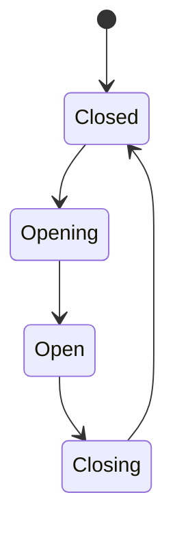
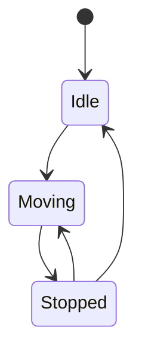
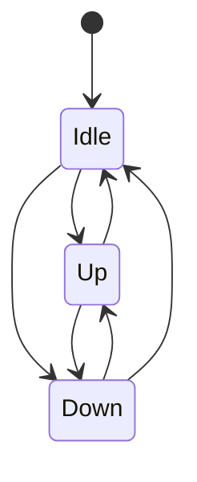
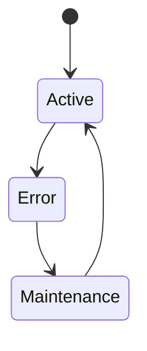

# Elevator Simulator - Backend

## Overview

This is the backend for the Elevator Simulator. It is responsible for the following:

- REST API for elevator control system
- WebSocket for real-time state updates
- Local state management
- Error handling
- Logging

Based on the configuration, application creates the elevators inside the building and provides the REST API for controlling them.
REST API provides a way to control the elevators from the hall and inside the elevator.
WebSocket provides a way to get the real-time state updates of the elevators, so the frontend can update the UI to the current state of the elevators and react to the events like door opening/closing, elevator moving, etc.

### Handling elevator state changes

The elevator state is managed by the `ElevatorService` in the `elevator` module. It is responsible for the elevator state and the elevator movement. The elevator state is decoupled from the simulation logic, so it can be tested independently.

Elevator keeps track of the current floor, direction, door state, motion state, destination floors and status.

Whenever the elevator state changes, the `ElevatorService` emits an event via `ElevatorEventEmitterService` in the `elevator` module. Those events are handled then by:
- `ElevatorEventsGateway` in the `websocket` module, which broadcasts the event to the WebSocket clients
- `SimulationModule` in the `simulation` module, which handles the simulation of the elevator movement and door opening/closing based on the timings from the configuration

#### Door state

Door state keeps track of the current door state of the elevator. The door work in a state machine, which is described in the `ElevatorDoorState` enum in the `elevator.interface.ts` file.

The state machine is described in the following diagram:



Only when the door is closed, the elevator can move.

#### Motion state

Motion state represents the current motion state of the elevator. The motion state work in a state machine, which is described in the `ElevatorMotionState` enum in the `elevator.interface.ts` file.

The state machine is described in the following diagram:



When the elevator is moving, it can be stopped at a floor. When the elevator is stopped, it can either move again (start another request) or become idle (no more requests).

#### Direction

Direction represents the current direction of the elevator. The direction can be up, down or idle (when the elevator has no requests). The direction is set when the elevator starts moving to the target floor.



#### Destination floors

Destination floors represents the floors that the elevator is going to visit in the order they are scheduled. The destination floors are set when the elevator is scheduled to move to a floor.
When the elevator is idle, the destination floors are empty.

Algorithm for sorting the destination floors can be found in the `sortDestinations` method in the `elevator.service.ts` file.

#### Status

Status represents the current status of the elevator. The status can be active, error or maintenance. 



The elevator can get to error state randomly.

The elevator gets to maintenance state when the elevator is getting fixed.

When the elevator is in active state, it can be used to serve requests.
When the elevator is in error or maintenance state, it cannot be used to serve requests. 

### Simulating elevator movement and door opening/closing

The simulation logic is handled by the `SimulationModule` in the `simulation` module, specifically by the `MotionSimulationService` and `DoorSimulationService` in the `motion-simulation` and `door-simulation` submodules. It is responsible for the simulation of the elevator movement and door opening/closing based on the timings from the configuration using `setTimeout` and `clearTimeout`.

### Communication with the frontend

The frontend communicates with the backend using the REST API and WebSocket.

- REST API is used to control the elevators from the hall and inside the elevator
- WebSocket is used to get the real-time state updates of the elevators (just subscribing to the events, no requests are made to the backend)

## Tech stack

- NestJS
- TypeScript
- EventEmitter
- Unifig
- WebSocket (Socket.IO)
- Jest
- Swagger
- Docker & Docker Compose

## Project Structure

- `src/` - Source code
- `requests/` - Request files for testing

### Modules

- `building/` - Building module, responsible for the building configuration and state
- `elevator/` - Elevator module, responsible for the elevator state
- `elevator-registry/` - Elevator registry module, responsible for creating and keeping track of elevators
- `hall/` - Hall module, responsible for the requests to elevators from the hall
- `scheduler/` - Scheduler module, responsible for scheduling hall requests to elevators
- `simulation/` - Simulation module, provides the simulation of the elevator movement and door opening/closing
- `websocket/` - WebSocket module, exposes the WebSocket server for real-time state updates of elevators

### Tests

There are some unit tests for core functionality, like elevator movement and door opening/closing (managing the elevator state) and for the WebSocket gateway.

To run the tests, use the following command:
```bash
npm test
```

## Quick Start

```bash
npm install
npm run start:dev
```

## API Documentation

API documentation is available at http://localhost:3000/swagger

## Development

For development, you can use the following command:
```bash
npm run start:dev
```

This will start the server in development mode with hot reloading.

